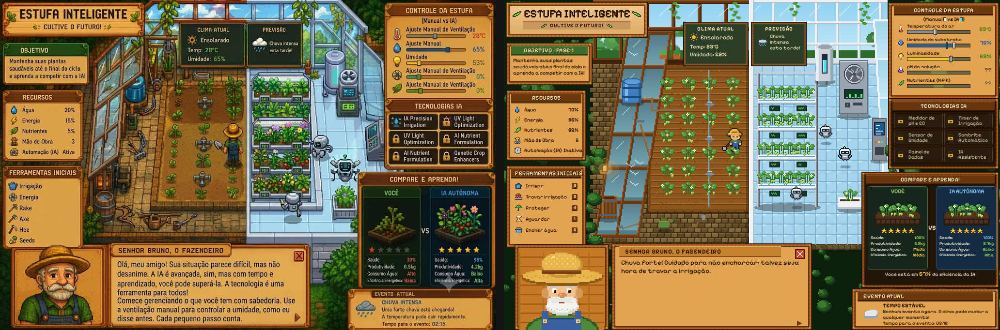

# Semente da Evolução — versão web

Serious game 2D top-down de agricultura de precisão (frente "Game" da iniciação científica AgroLab).
Você é um fazendeiro que desconfia da tecnologia e cuida de uma estufa ao lado de uma **estufa autônoma**
controlada por IA. São **5 fases de 1 minuto**: vence quem colhe antes do tempo acabar; quem perde a planta ou o tempo
perde uma das **3 vidas do jogo** e repete a fase (sem vidas, game over e recomeço da fase 1). Cada fase traz uma tecnologia nova (medidor de pH,
timer, sensor, sombrite, painel de dados), que ajuda, mas nunca age sozinha.

HTML + CSS + JavaScript puro (ES modules), sem build e sem `node_modules`.



## Como rodar

**Windows:** extraia o ZIP e dê dois cliques em `iniciar.bat` (dentro da pasta `SementeDaEvolucao-Web`). Ele sobe um
servidor local e abre o navegador em `http://localhost:8080/`. Usa o Node.js ou o Python, se estiverem instalados;
se não, usa o **PowerShell**, que já vem no Windows, sem precisar instalar nada. **Deixe a janela preta aberta
enquanto joga**: fechá-la desliga o jogo.

> **"Não foi possível conectar a localhost:8080"?** O servidor não está rodando. Abra o `iniciar.bat` de novo (sem
> fechar a janela preta) e aperte F5 no navegador. Se o Windows mostrar "O Windows protegeu o computador", clique em
> **Mais informações → Executar assim mesmo** (o aviso aparece porque o arquivo veio da internet).

**Linux/macOS:** `./iniciar.sh`

**Manual:** `node servidor.mjs` (ou `python -m http.server 8080`) e abrir `http://localhost:8080/`.

> Abrir o `index.html` direto (duplo clique, `file://`) **não funciona**: navegadores bloqueiam ES modules fora de
> um servidor.

## Controles

| Tecla | Ação |
|---|---|
| 1 | Aguardar (não fazer nada) |
| 2 | Travar irrigação |
| 3 | Irrigar |
| 4 | Proteger a planta (sombrite por 15 s; 30 s com o Sombrite Reforçado) |
| R | Encher o tanque de água |
| P / Espaço | Pausa |
| Enter | Confirmar (telas de fase) |
| F | Tela cheia (projetor) |
| M | Liga/desliga o som (também há o botão ao lado do título) |
| B | Minimizar a fala do Sr. Bruno |
| ` (crase, ao lado do 1) | Modo debug: FPS, variáveis, velocidade 1×/2×/4×, disparar eventos, sobrepor a referência |

Também dá para clicar nas ferramentas do painel esquerdo. Um Arduino pode emular as teclas 1–4 como teclado USB.

## Parâmetros de URL

| Parâmetro | Exemplo | Efeito |
|---|---|---|
| `ia` | `?ia=mock` | Provedor de IA: `regras` (padrão), `mock` ou `http` |
| `iaUrl` | `?ia=http&iaUrl=http://localhost:5000/decidir` | Endpoint da IA de vocês |
| `mockAcoes` | `?ia=mock&mockAcoes=Irrigate,DoNothing` | Sequência fixa do mock |
| `falasUrl` | `?falasUrl=http://localhost:5000/fala` | Gerador externo das falas do Bruno |
| `fase` / `cultura` | `?fase=3&cultura=Tomate` | Começar numa fase (1–5) e cultura (útil para apresentar) |
| `semente` | `?semente=42` | Clima reproduzível |
| `intro=0`, `debug=1` | | Pular a tela de introdução; abrir o debug |

## Teste headless

```
node tests/simular.mjs
```

Roda partidas completas das 3 culturas sem navegador e confere: nenhum NaN, recursos dentro dos limites, fases de no
máximo 1:30, os 6 estágios de crescimento, quem joga atento vence, quem fica parado ou irriga sem parar perde, nada
age sozinho na estufa do jogador, as 3 vidas e o game over, e o fallback dos provedores de IA.

## Estrutura

```
index.html, css/estilo.css     HUD em HTML/CSS (palco 1024×682 = a referência)
data/                          balanceamento, culturas, fases/tecnologias, falas, config da IA (JSON)
js/core/                       GameManager, EnvironmentState          ┐
js/crops/                      CropData, PlantController              │ simulação: sem DOM/Canvas,
js/resources/                  ResourceSystem, PlayerActionController │ roda no Node
js/systems/                    WeatherEventSystem, ClimateModel,      │
                               ProgressionSystem                      │
js/ai/                         AutonomousFarmAI, BrunoDialogue,       │
                               IAProvider + provedores/               ┘
js/render/                     mundo em Canvas 512×341 (pixel art gerada por código)
js/ui/                         HUDController, Vistas, TelasFase, Debug, Escala
tests/simular.mjs              teste headless
docs/                          spec visual, paridade C#→JS, decisões, contrato da IA, assets pendentes, comparação
```

Os nomes das classes e métodos são os mesmos do C# (`Tick`, `Execute`, `TrySpend`, `SuggestAction`,
`EvaluateConditions`, `GetContextualTip`, `ScoreboardLine`...). Ver `docs/paridade.md`.

## Documentação

- `docs/spec-visual.md`: regiões, paleta, tipografia e molduras medidas da referência
- `docs/paridade.md`: cada regra do C# e onde ela está no JS (fiel, reconstruída ou nova)
- `docs/decisoes.md`: decisões assumidas durante o porte
- `docs/contrato-ia.md`: como ligar a IA de vocês
- `docs/assets-pendentes.md`: o que trocar por arte desenhada
- `docs/comparacao/`: capturas e diferenças em relação à referência

## Próximo passo: executável

Para gerar um `.exe` (sem navegador aparente, tela cheia no projetor), basta empacotar esta pasta com
**Electron** ou **Tauri**. O jogo já roda sem build, então o empacotamento é só um `main.js` do Electron
apontando para o `index.html`.
